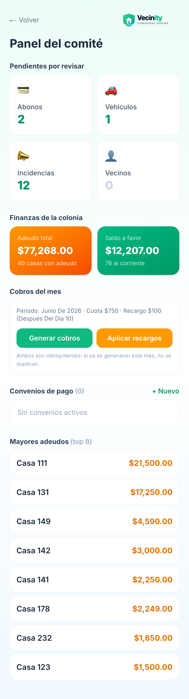
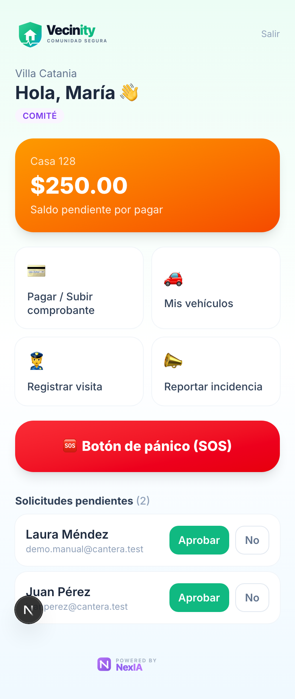
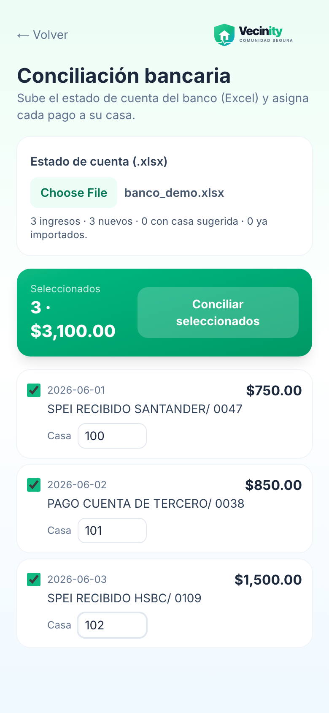
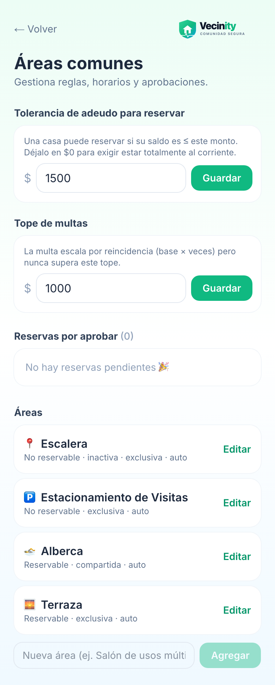
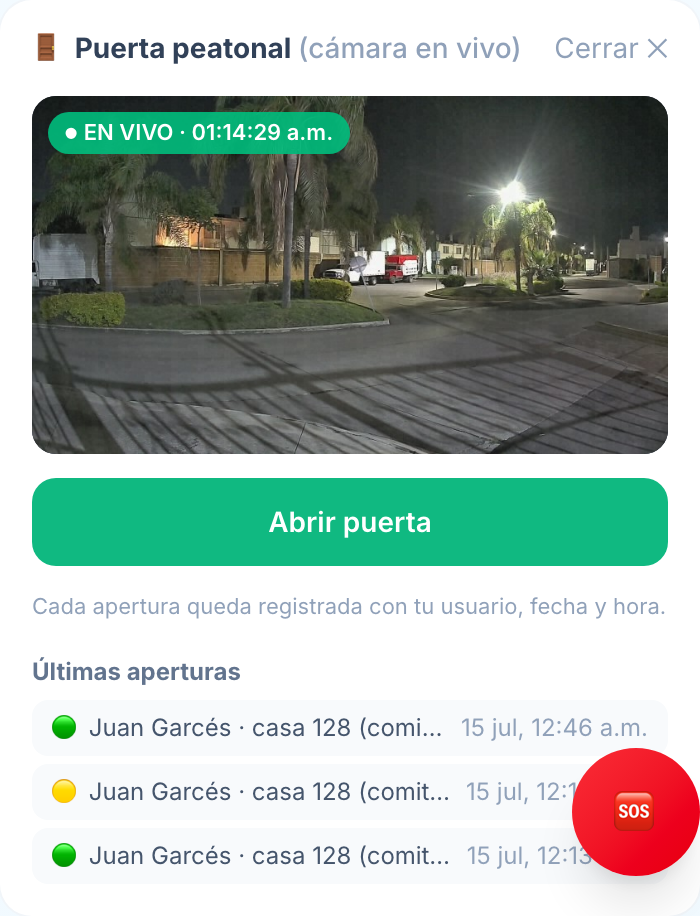

# 🗂 Manual del Administrador (Comité) — Vecinity

> Guía para **comité y administración**. Aquí está todo lo que puedes gobernar
> desde la app: aprobaciones, finanzas, multas, comunicados, áreas comunes y el
> acceso físico de la caseta (pluma vehicular, puerta peatonal y cámara).

---

## 🧭 Índice

1. [Tu rol y cómo entras](#1-tu-rol-y-cómo-entras)
2. [Panel del comité (centro de mando)](#2-panel-del-comité)
3. [Aprobaciones diarias](#3-aprobaciones-diarias)
4. [Cobros del mes y convenios de pago](#4-cobros-del-mes-y-convenios)
5. [Finanzas](#5-finanzas)
6. [Multas por casa (corregir / cancelar)](#6-multas-por-casa)
7. [Comunicados](#7-comunicados)
8. [Áreas comunes](#8-áreas-comunes)
9. [Credenciales de acceso (tarjetas PVC)](#9-credenciales-de-acceso)
10. [Acceso de la caseta](#10-acceso-de-la-caseta)
    · [Pluma vehicular (RFID)](#101-pluma-vehicular-rfid)
    · [Puerta peatonal (rostros)](#102-puerta-peatonal-rostros)
    · [Cámara en vivo y apertura remota](#103-cámara-en-vivo-y-apertura-remota)
11. [Red de vigilantes voluntarios](#11-red-de-vigilantes)
12. [Buenas prácticas y seguridad](#12-buenas-prácticas-y-seguridad)

---

## 1. Tu rol y cómo entras

Tu cuenta tiene rol de **comité** o **admin**. Entras igual que cualquier
vecino (correo y contraseña) y en tu panel aparece el acceso al
**Panel del comité**. Todas las funciones de vecino (estado de cuenta, SOS,
reservas…) también las tienes.

> Los roles los asigna la administración. Si alguien deja el comité, cambia su
> rol de vuelta a residente — el acceso a todo lo de esta guía se cierra solo.

---

## 2. Panel del comité

Tu **centro de mando** (`Panel del comité`):

- **Pendientes por revisar**: abonos, vehículos, incidencias y nuevos vecinos,
  en un solo lugar.
- **Finanzas de la colonia**: adeudo total, saldo a favor, # de morosos y # al
  corriente.
- **Cobros del mes**: generar la cuota mensual y aplicar recargos.
- **Convenios de pago** activos y **mayores adeudos** (top de casas con saldo).
- **Vigilantes**: aprobar o dar de baja voluntarios.
- **Acceso de la caseta**: RFID, rostros de la puerta peatonal y la cámara
  (sección 10).

Las **solicitudes de nuevos vecinos** también aparecen en tu panel principal:

---

## 3. Aprobaciones diarias

Todo lo que los vecinos suben pasa por ti:

| Qué | Dónde | Qué revisar |
|---|---|---|
| **Nuevo vecino** | Panel principal → Solicitudes | Que el nombre corresponda a la casa de la invitación |
| **Abono (comprobante)** | Panel comité → Pendientes | Foto legible, monto y fecha; al aprobar, el saldo se abona solo y el vecino puede descargar recibo |
| **Vehículo** | Panel comité → Pendientes | Placa y datos; al aprobar puedes asignar tarjeta RFID |
| **Incidencia** | Panel comité → Pendientes | Evidencia (hora y lugar sellados); decide amonestación o multa |
| **Propuesta de multa (IA)** | Panel comité → Propuestas | La generó una reincidencia verificada por placa; se aprueba con **un voto** |
| **Rostro puerta peatonal** | Panel comité → Acceso peatonal | Foto tipo credencial nítida; al aprobar, la puerta lo activa sola en ~10 min |

> Cada decisión queda registrada con tu usuario. Cancelar o corregir **no
> borra**: deja rastro de auditoría.

---

## 4. Cobros del mes y convenios

En el panel del comité:

- **Generar cuota mensual**: un toque crea el cargo del mes a todas las casas
  — la app **no duplica** si ya se generó.
- **Aplicar recargos**: a las casas vencidas, según el reglamento.
- **Convenios de pago**: para casas con adeudo grande. Un convenio **activo**
  protege sus accesos (pluma) aunque el saldo siga arriba del umbral, mientras
  lo vayan cumpliendo.

> El **umbral de suspensión** (desde qué adeudo se corta la pluma) se edita en
> la tarjeta **Acceso RFID** — ver [sección 10.1](#101-pluma-vehicular-rfid).

---

## 5. Finanzas

Desde **Finanzas** tienes el ciclo completo del dinero de la colonia:

### Gastos de la colonia
Registra cada gasto (concepto, monto, **categoría**, fecha y comprobante
opcional), ve el total y el desglose por categoría, y **exporta a CSV**.
Las categorías se administran (crear/editar) y el sistema **aprende**: sugiere
la categoría según el concepto.

### Conciliación bancaria
Sube el **estado de cuenta del banco** (Excel de BBVA). La app:

- **Guarda todas las filas** (no solo las que concilias hoy) y te muestra la
  **cobertura**: hasta qué día está cargado el banco.
- Detecta **duplicados** de cargas anteriores para no abonar dos veces.
- Te deja **asignar cada pago a su casa** — y recuerda tus asignaciones para
  sugerirlas la próxima vez. Al confirmar, el saldo de la casa se abona solo.
- Los **cargos** (comisiones, servicios) se registran como gastos con su
  categoría sugerida.

### Auditoría de pagos
Revisión cruzada de los abonos: quién los subió, quién los aprobó, con qué
comprobante. Útil para cierres de mes y para responder cualquier duda de un
vecino con evidencia.

### Estado de cuenta por casa
Consulta el detalle de **cualquier casa**: cargos, abonos, recargos, multas y
saldo — la misma vista que ve el vecino, pero de toda la colonia.

### Proyectos de la colonia
Da de alta proyectos (impermeabilización, cámaras, jardines…) con sus
documentos y gastos ligados — transparencia para la asamblea.

### Reporte de multas (IA)
Eliges un **mes** y la IA redacta un reporte claro: resumen, desglose por
categoría, reincidencias y observaciones — listo para compartir.

---

## 6. Multas por casa

En **Multas** ves todas las multas de cada casa y puedes:

- **Corregir** una multa (monto o casa equivocada): la app ajusta el cargo, el
  saldo y la resolución oficial **de una sola vez**, con nota obligatoria.
- **Cancelar** una multa: el cargo no se borra — queda marcado como rechazado
  (auditoría), el saldo se revierte y se genera la resolución de cancelación.

> Regla de oro: **nunca se borra nada**. Corregir y cancelar dejan rastro de
> quién, cuándo y por qué.

---

## 7. Comunicados

En **Comunicados** creas los avisos oficiales:

- **Público** (toda la colonia) o **dirigido** a casas específicas.
- Al publicar, se **envía por Telegram** a los vecinos conectados con Caty y
  queda en la app para los demás.
- Ves cuántos lo han **leído**.

---

## 8. Áreas comunes

Desde **Gestionar áreas comunes** defines las **reglas** de cada área:
horarios, costo, depósito, aforo, aprobación automática o manual — e incluso
**agregar áreas nuevas**. Aquí también está la **bandeja de reservas** por
aprobar, y el calendario general para ver la ocupación.

---

## 9. Credenciales de acceso

El módulo **Credenciales** genera las **tarjetas PVC** de la colonia
(vehiculares y peatonales) con **QR verificable**: cualquiera puede escanear
el QR y la app confirma si la credencial es vigente y de quién es.

- Apruebas la solicitud → la tarjeta entra a la **cola de impresión** de la
  impresora de la caseta (Zebra).
- El stock de tarjetas en blanco se descuenta solo al imprimir; si no hay
  stock, la app te avisa antes de aprobar.

---

## 10. Acceso de la caseta

Todo el acceso físico se gobierna desde tu panel — sin tocar ningún equipo.
Los cambios los aplica el sistema de la caseta en **~10 minutos máximo**.

### 10.1 Pluma vehicular (RFID)

Tarjeta **Acceso RFID (caseta)** en tu panel:

- **Regla automática**: cuando una casa supera el **umbral de adeudo**, sus
  tarjetas se **suspenden solas**; al ponerse al corriente (o con convenio
  activo) se **reactivan solas**. Cada movimiento te llega por Telegram.
- **Override por casa**: `automático` (la regla decide) · `forzar activo`
  (casa exenta) · `forzar suspendido` (suspender aunque esté al corriente,
  con motivo obligatorio).
- **Umbral editable**: define desde qué adeudo se corta.
- **Semáforo "caseta en línea"**: te dice si el equipo de la caseta está
  reportando (si se cae, los cambios se aplican en cuanto vuelva).
- **Bitácora**: cada suspensión/reactivación con quién, cuándo y por qué.

### 10.2 Puerta peatonal (rostros)

Tarjeta **Acceso peatonal**: apruebas o rechazas las fotos de rostro que suben
los vecinos, ves quiénes están activos y retiras a quien ya no viva ahí.

> ⚖️ **Regla de la colonia**: el acceso peatonal a la vivienda **nunca se
> suspende** — ni por adeudo. La presión de cobranza es solo vehicular. Esta
> regla está blindada en el sistema: aunque quisieras, no hay botón para
> suspender un rostro por mora.

### 10.3 Cámara en vivo y apertura remota

Tarjeta **🚪 Puerta peatonal (cámara en vivo)**:

- **Ver**: la cámara de la puerta en vivo (sello **● EN VIVO** con hora).
- **Abrir puerta**: confirmación de dos pasos; la puerta abre en ~3 segundos.
- **Últimas aperturas**: la bitácora — quién abrió (vecino, guardia o comité),
  de qué casa, cuándo y si la apertura se ejecutó (🟢), expiró (🟡) o falló (🔴).

> Los **vecinos también pueden abrir** (para recibir a sus visitas). El control
> no es prohibirles el botón — es que **toda apertura queda firmada** con su
> nombre y casa, y tú la ves aquí.

> 🛡️ Seguridad del comando: si el sistema de la caseta estuviera caído cuando
> alguien toca "Abrir", el comando **caduca en 30 segundos** — jamás se abre
> la puerta minutos después por un comando viejo (aparece 🟡 *expirado*).

---

## 11. Red de vigilantes

Los vecinos pueden postularse como **vigilantes voluntarios** (desde la app o
con Caty). En tu panel los apruebas o das de baja. Los vigilantes activos
reciben las alertas **SOS** de su zona y pueden marcar el acuse de atención.

---

## 12. Buenas prácticas y seguridad

- **Nada se borra**: multas, abonos y aperturas se corrigen o cancelan con
  rastro. Ante cualquier reclamo, la bitácora responde.
- **No compartas tu cuenta**: las acciones quedan firmadas con tu usuario.
- **Datos personales**: los correos, teléfonos y rostros de los vecinos viven
  protegidos en el sistema. No los exportes ni los copies a documentos fuera
  de la app.
- **Fail-safe de la caseta**: si el equipo local se cae, nada "se abre solo" —
  los comandos caducan y las suspensiones pendientes se aplican al volver.
- **El deploy de cambios de la app** lo hace el equipo de NexIA; reporta
  cualquier comportamiento extraño a soporte@nexiasoluciones.com.mx.

---

*Vecinity · Comunidad Segura — Powered by NexIA*
