# 📖 Manual del Vecino — Vecinity

> **Vecinity** es la app de tu colonia: tu estado de cuenta, reservas de áreas
> comunes, pases QR para tus visitas, la cámara de la puerta peatonal, el botón
> de pánico y los avisos del comité — todo desde tu teléfono.

---

## 🧭 Índice

1. [Cómo registrarte (primera vez)](#1-cómo-registrarte-primera-vez)
2. [Conectar Telegram (Caty)](#2-conectar-telegram-caty)
3. [Esperar la aprobación](#3-esperar-la-aprobación)
4. [Iniciar sesión e instalar la app](#4-iniciar-sesión-e-instalar-la-app)
5. [Tu panel](#5-tu-panel)
6. [Mi estado de cuenta](#6-mi-estado-de-cuenta)
7. [Tu rostro para la puerta peatonal](#7-tu-rostro-para-la-puerta-peatonal)
8. [Pagar / subir comprobante](#8-pagar--subir-comprobante)
9. [Reservar áreas comunes](#9-reservar-áreas-comunes)
10. [Registrar una visita (pase QR)](#10-registrar-una-visita-pase-qr)
11. [Ver la cámara y abrirle la puerta a tu visita](#11-ver-la-cámara-y-abrirle-la-puerta-a-tu-visita)
12. [Tus vehículos](#12-tus-vehículos)
13. [Reportar una incidencia](#13-reportar-una-incidencia)
14. [Botón de pánico (SOS)](#14-botón-de-pánico-sos)
15. [Comunicados](#15-comunicados)
16. [Todo lo que Caty puede hacer por ti](#16-todo-lo-que-caty-puede-hacer-por-ti)
17. [Preguntas frecuentes](#17-preguntas-frecuentes)

---

## 1. Cómo registrarte (primera vez)

Tu comité te comparte un **código de invitación** (algo como `CAT-128`). Abre la
app y sigue 4 pasos:

### Paso 1 — Tu invitación
Escribe el código que te dieron y toca **Continuar**.

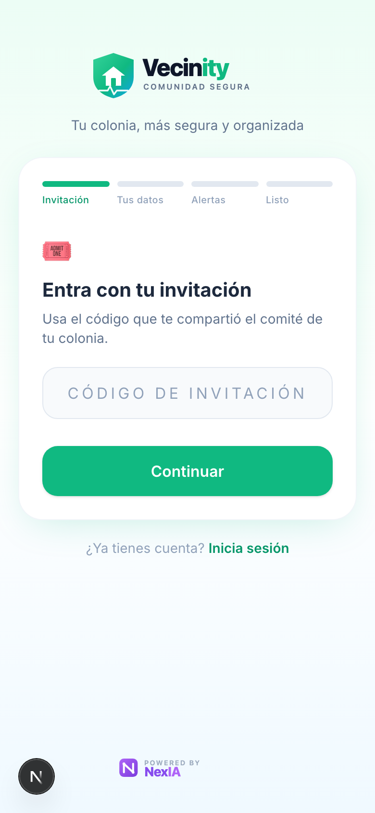

### Paso 2 — Crea tu cuenta
Pon tu **nombre, correo, una contraseña** y tu **WhatsApp/teléfono**. Tu colonia
y calle ya vienen en la invitación. Toca **Crear cuenta**.

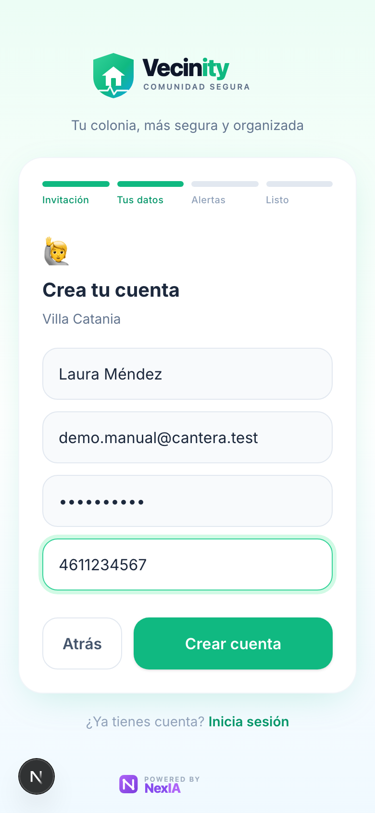

### Paso 3 — Conecta tus alertas
Toca **Conectar Telegram** para recibir avisos (SOS, pagos, noticias del
comité). Puedes hacerlo después si prefieres.

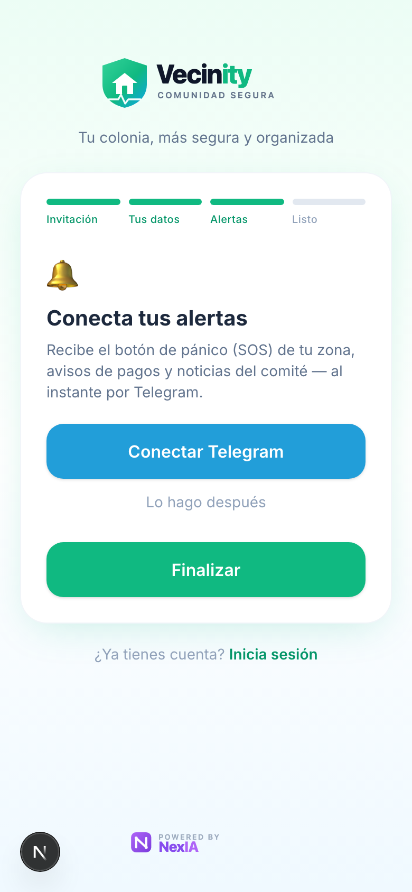

### Paso 4 — ¡Listo!
Tu cuenta queda creada. El comité revisará tu solicitud y te avisará cuando
tengas acceso.

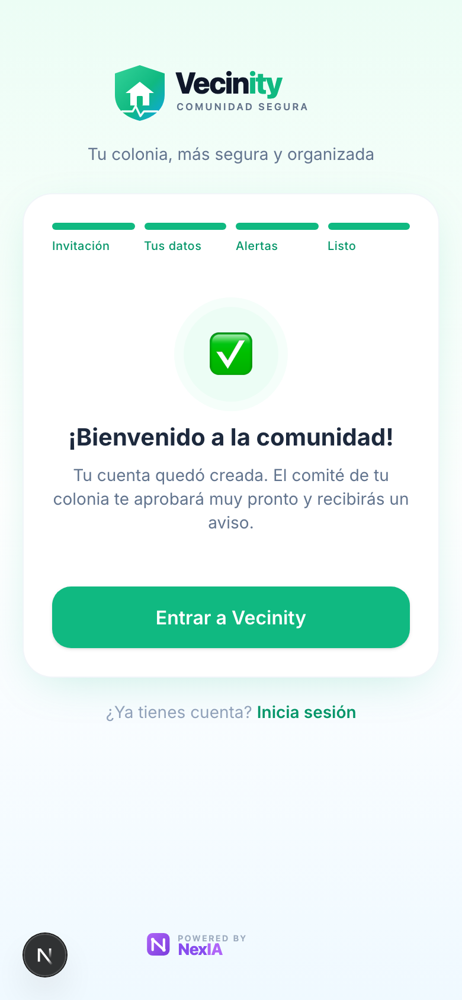

> 🏠 **¿Eres propietario de una casa que rentas?** Pide al comité un código de
> propietario (tipo `PROP`). Con él ves los pagos y el estado de cuenta de tu
> casa, sin acceso a las funciones del residente (visitas, SOS).

---

## 2. Conectar Telegram (Caty)

Al tocar **Conectar Telegram**, se abre el bot **Caty**
(@Caty_VCatania_bot). Presiona **Iniciar / Start** y Caty te confirmará:

> ✅ *¡Listo! Soy Caty 🛡️. Desde ahora te aviso por aquí: alertas SOS de tu
> zona, recordatorios de pago y noticias del comité.*

Caty no solo avisa — también **atiende**: consulta tu saldo, recibe tu
comprobante de pago en foto, reserva áreas y más. Ver la
[sección 16](#16-todo-lo-que-caty-puede-hacer-por-ti).

---

## 3. Esperar la aprobación

Mientras el comité aprueba tu solicitud verás esta pantalla. Es normal: en
cuanto te aprueben podrás entrar (y te avisamos por Telegram si lo conectaste).

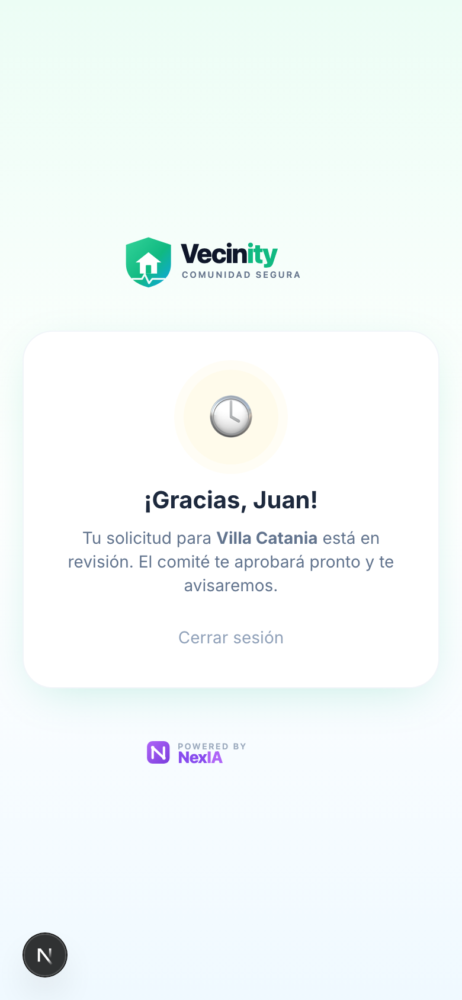

---

## 4. Iniciar sesión e instalar la app

Las siguientes veces entra con tu **correo y contraseña**.

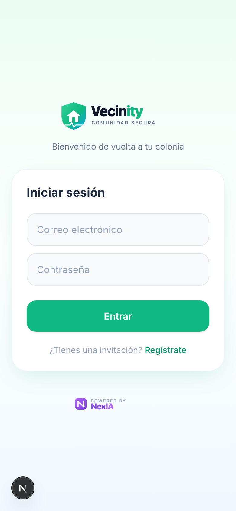

- **¿Olvidaste tu contraseña?** En la pantalla de login toca
  **"¿Olvidaste tu contraseña?"** y sigue las instrucciones; también puedes
  pedirle a Caty un enlace de recuperación por Telegram.
- **📱 Instálala como app:** cuando aparezca el banner **"Instala Vecinity"**,
  toca **Instalar**. Queda en tu pantalla de inicio como cualquier app, sin
  ocupar casi espacio.

---

## 5. Tu panel

Una vez aprobado, este es tu panel. Todo de un vistazo:

- **Tu saldo**: verde si estás al corriente, **ámbar/naranja si tienes adeudo**.
  Toca **Ver detalle** para ir a tu estado de cuenta.
- **Conecta con Caty**: si aún no ligas tu Telegram.
- **Comunicados**: avisos del comité.
- **Reservar áreas comunes** y **Calendario de reservas**.
- **Acciones rápidas**: pagar/subir comprobante, tus vehículos, registrar
  visita, reportar incidencia.
- **🆘 Botón de pánico (SOS)**: siempre visible, abajo a la derecha.

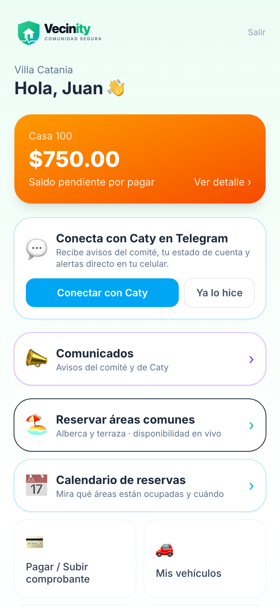

---

## 6. Mi estado de cuenta

Toca la tarjeta de tu saldo (**Ver detalle**) para abrir **Mi estado de
cuenta**:

- **Saldo actual** de tu casa, al día.
- **Movimientos**: cada cuota, recargo, multa o abono, con fecha y el saldo
  después de cada movimiento.
- **📄 Descargar recibo**: en cada abono aprobado puedes descargar tu recibo.
- **Comprobantes**: si subiste foto del comprobante, ahí queda ligada al
  movimiento.

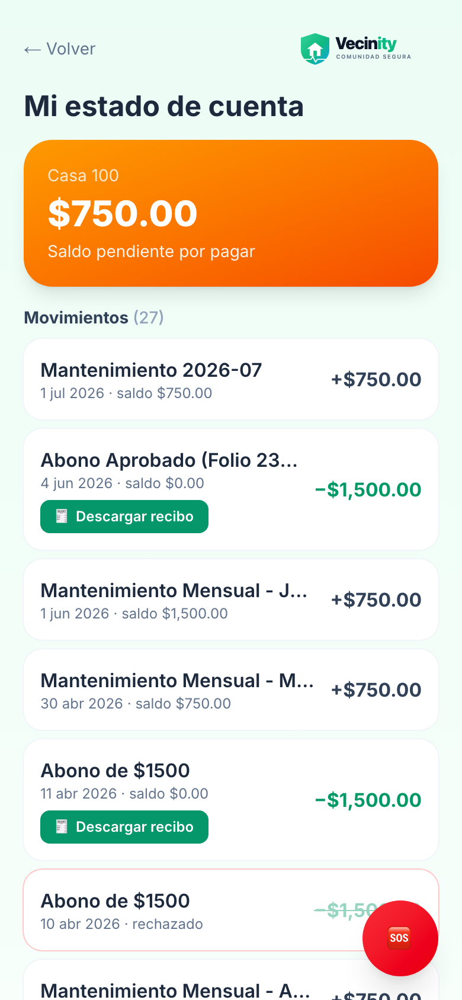

---

## 7. Tu rostro para la puerta peatonal

La puerta peatonal de la colonia abre con **reconocimiento de rostro**. Para
registrarte, entra a **Mi estado de cuenta** y baja hasta la tarjeta
**Acceso peatonal**:

1. Toca **subir foto** y tómate una foto tipo credencial: rostro centrado, bien
   iluminado, de preferencia con fondo claro.
2. El comité la revisa y aprueba.
3. En cuanto se active en la terminal, **la puerta te reconoce y abre sola** —
   sin llaves ni tarjetas.

Puedes registrar a los miembros de tu casa (hasta 10 rostros por casa) y
retirar los que ya no vivan ahí.

> ℹ️ El acceso peatonal a tu vivienda **nunca se suspende**. (El acceso
> vehicular por la pluma sí depende de estar al corriente.)

---

## 8. Pagar / subir comprobante

Toca **Pagar / Subir comprobante**. Ahí ves tu **saldo** y puedes **registrar
un abono** subiendo la **foto de tu comprobante** de depósito o transferencia.

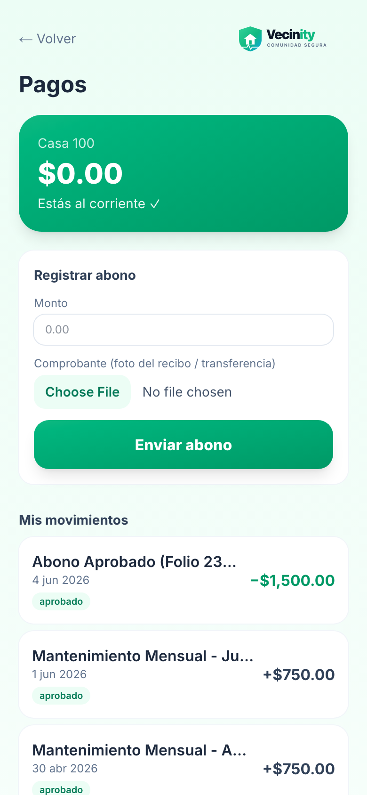

- El comité revisa tu comprobante y, al aprobarlo, **tu saldo se actualiza
  automáticamente** y puedes descargar tu recibo.
- **También por Telegram:** mándale la foto del comprobante a **Caty** y ella
  lo registra por ti.
- Si tienes un adeudo grande, el comité puede ofrecerte un **convenio de
  pago**; mientras el convenio esté activo y al corriente, conservas tus
  accesos.

---

## 9. Reservar áreas comunes

Toca **Reservar áreas comunes**. Elige el área (por ejemplo **Alberca** —
gratis, o **Terraza** — evento con costo y depósito), revisa la
**disponibilidad del día** y confirma tu horario.

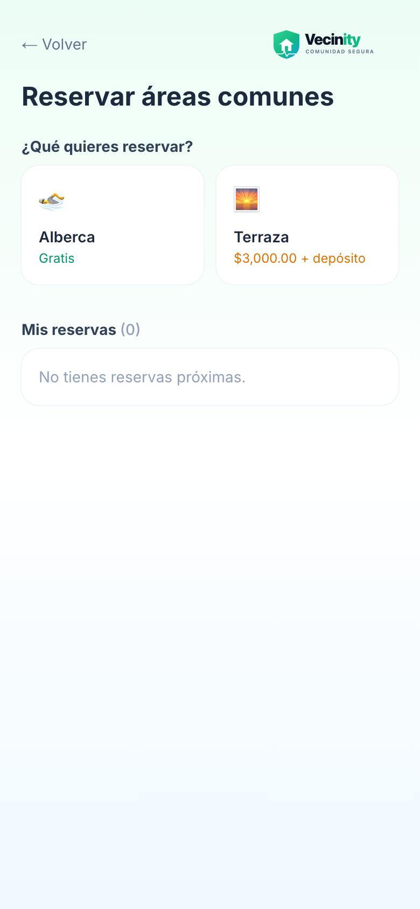

- Tus reservas aparecen en **"Mis reservas"**, donde puedes cancelarlas.
- En **Calendario de reservas** ves qué áreas están ocupadas y cuándo — útil
  antes de planear tu evento:

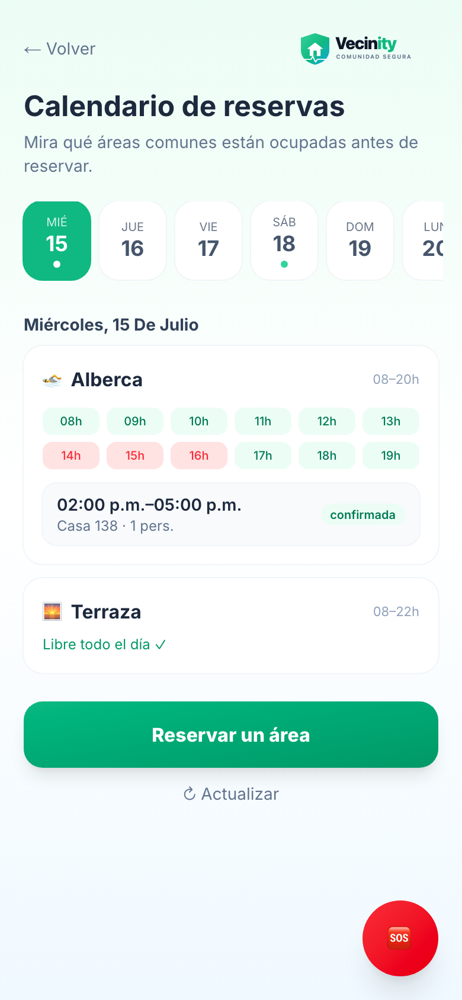

> 💡 Solo puedes reservar si estás **al corriente** con tu cuota. El día de tu
> evento, el guardia te entrega la llave del área y la recibe al final.

---

## 10. Registrar una visita (pase QR)

Toca **Registrar visita**, escribe el **nombre de tu invitado** y (opcional)
cuándo llega. Toca **Generar pase de visita**.

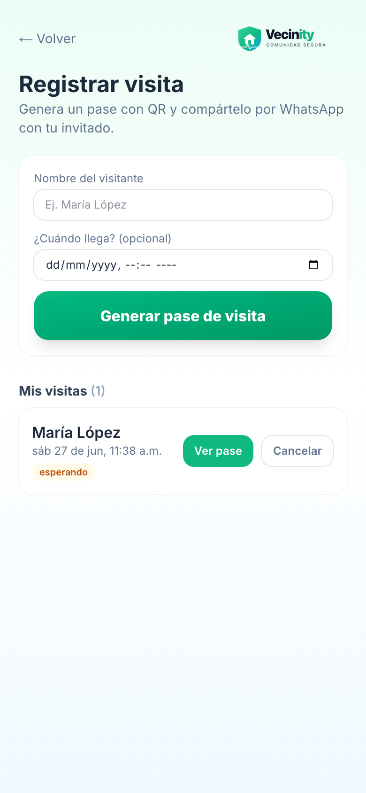

Se crea un **pase con código QR** que compartes por **WhatsApp**:

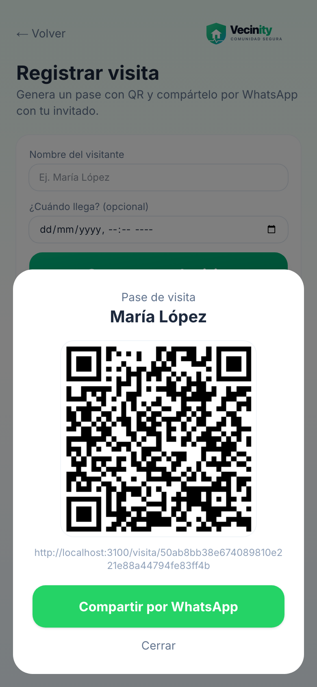

Tu invitado solo muestra ese pase en la **caseta** — no necesita instalar
nada. Así lo ve el guardia al abrirlo:

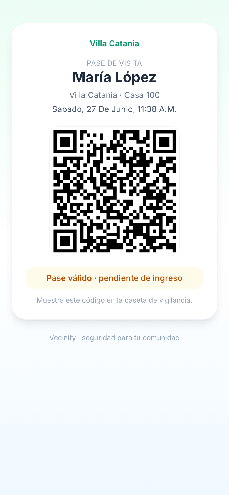

---

## 11. Ver la cámara y abrirle la puerta a tu visita

En la misma pantalla de **Registrar visita** está la tarjeta
**🚪 Puerta peatonal (cámara en vivo)**:

1. Toca **Ver** — la cámara de la puerta se abre **en vivo** (verás el sello
   verde **● EN VIVO** con la hora).
2. ¿Es tu visita la que está afuera? Toca **Abrir puerta** y confirma con
   **✓ Sí, abrir la puerta**.
3. En unos 3 segundos la puerta abre y la app te muestra **"✓ Puerta abierta"**.

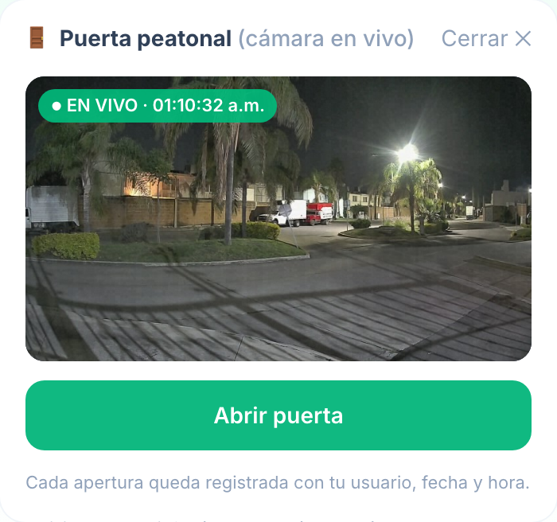

> 🔒 **Cada apertura queda registrada a tu nombre**, con fecha y hora — igual
> que si le abrieras con tu llave. Ábrele solo a gente que reconozcas: tú
> respondes por tu visita.

---

## 12. Tus vehículos

Toca **Mis vehículos** para dar de alta tus autos: elige **marca y modelo**,
escribe la **placa** y el **color**, y toca **Agregar vehículo**.

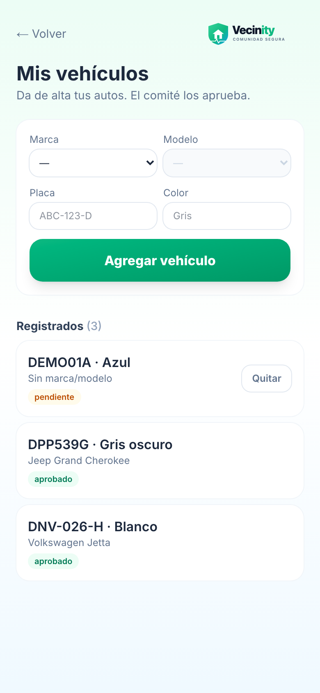

- Cada auto queda **pendiente** hasta que el comité lo aprueba y (si aplica) le
  asigna su **tarjeta RFID** para la pluma vehicular.
- Si vendes o das de baja un auto, solicítalo desde la misma pantalla; el
  comité confirma la baja y recupera la tarjeta.

> ⚠️ Si tu casa acumula adeudo por encima del límite de la colonia, **las
> tarjetas de la pluma se suspenden automáticamente** — y se reactivan solas
> cuando te pones al corriente (o con un convenio de pago activo). El acceso
> peatonal con tu rostro no se toca.

---

## 13. Reportar una incidencia

Toca **Reportar incidencia** para avisar de un problema (ruido, mal uso de
amenidades, mascotas, fachada, etc.). Elige la **categoría**, indica la **casa
o placa** del infractor, describe lo que pasó y **toma una foto** de evidencia.

> 📸 Toma la foto **con la cámara** (no de la galería): la app guarda la **hora
> exacta** y, si lo permites, tu **ubicación**. Eso respalda el reporte.

> 🕵️ Tu reporte es **anónimo** para el infractor. El comité lo revisa y decide;
> si aplica multa, el monto sube por reincidencia (con un tope definido por tu
> colonia).

> 🤖 **Verificación automática:** si reportas por **placa** con foto, la app
> **lee la placa con IA** y la valida contra los autos registrados. La **1ª
> vez** es una **amonestación**; en reincidencia se genera una **propuesta de
> multa** que el comité aprueba con un voto. Al infractor se le avisa por
> Telegram.

---

## 14. Botón de pánico (SOS)

En una emergencia real, toca el **🆘 botón rojo** (siempre visible). Al
instante se avisa con tu nombre, casa y ubicación a:

- el **comité de tu zona**,
- el **capitán de tu calle**, y
- la **red de vigilantes voluntarios** de la colonia.

El primero que atiende marca el acuse, para que sepas que alguien ya va. La
app también te da el número **911** listo para marcar con tus datos a la mano.

> ⚠️ Úsalo solo para **emergencias reales**.

---

## 15. Comunicados

En **Comunicados** lees los avisos oficiales del comité: cortes de agua,
juntas, eventos, recordatorios. Los que van dirigidos a tu casa se marcan como
leídos cuando los abres; si tienes Telegram conectado, también te llegan por
Caty.

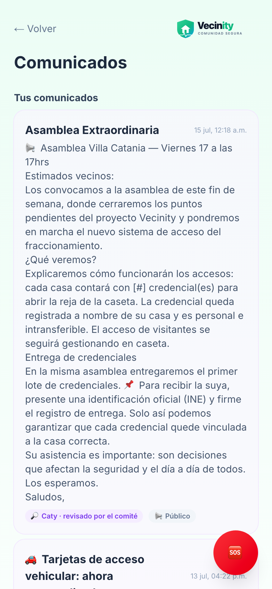

---

## 16. Todo lo que Caty puede hacer por ti

Con tu Telegram conectado, escríbele a **Caty** (@Caty_VCatania_bot):

| Le pides… | Y Caty… |
|---|---|
| "¿Cuánto debo?" | Te dice tu saldo y últimos movimientos |
| Foto de tu comprobante | Registra tu abono para revisión del comité |
| "Quiero reservar la alberca el sábado" | Consulta disponibilidad y reserva |
| "¿Qué dice el reglamento sobre mascotas?" | Te responde citando el reglamento |
| "Recuperar contraseña" | Te manda un enlace seguro para restablecerla |
| 🚨 (automático) | Te alerta de SOS en tu zona, pagos por vencer y comunicados |

---

## 17. Preguntas frecuentes

**¿No me llega el código de invitación?**
Pídeselo al comité de tu colonia.

**¿Por qué no puedo entrar todavía?**
Tu cuenta está en revisión. El comité debe aprobarte primero.

**¿Puedo reservar si debo dinero?**
No. Para reservar áreas comunes debes estar **al corriente**.

**¿Mi invitado necesita instalar la app?**
No. Solo muestra el **pase QR** en la caseta — o tú lo ves por la cámara y le
abres desde la app.

**Le abrí la puerta a alguien por error, ¿qué hago?**
Avísale a la caseta o al comité. Toda apertura queda registrada, así que es
fácil aclararlo.

**¿Por qué mi tarjeta de la pluma no abre?**
Casi siempre es adeudo por encima del límite. Revisa **Mi estado de cuenta**;
al ponerte al corriente se reactiva sola (unos 10 minutos).

**¿Puedo usar la app sin Telegram?**
Sí, pero no recibirás avisos automáticos (SOS, pagos, comunicados) ni podrás
usar a Caty. Recomendamos conectarlo.

**¿Mis datos están seguros?**
Sí. Cada quien ve solo lo suyo y lo de su colonia; las fotos de rostro viven
protegidas y solo se usan para la puerta.

---

*Vecinity · Comunidad Segura — Powered by NexIA*
