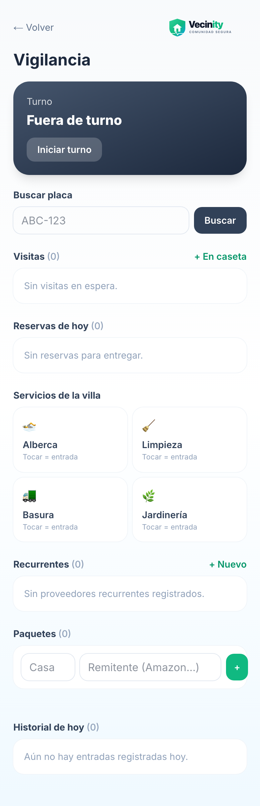
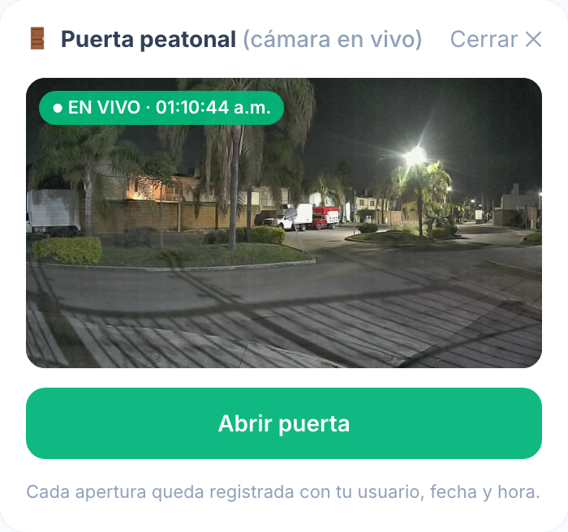

# 🛡 Manual del Vigilante (Caseta) — Vecinity

> Guía para los **guardias de la caseta**. Tu pantalla de vigilancia controla
> todo el movimiento del día: visitas, la cámara y apertura de la puerta
> peatonal, reservas, paquetes, proveedores y las alertas SOS.

---

## 🧭 Índice

1. [Entrar y tu turno](#1-entrar-y-tu-turno)
2. [Tu pantalla de un vistazo](#2-tu-pantalla-de-un-vistazo)
3. [Alertas SOS (lo primero)](#3-alertas-sos)
4. [Escanear pase QR de visita](#4-escanear-pase-qr)
5. [Cámara de la puerta peatonal y abrir](#5-cámara-de-la-puerta-peatonal)
6. [Registrar visita en caseta (sin pase)](#6-registrar-visita-en-caseta)
7. [Buscar placa y directorio](#7-buscar-placa-y-directorio)
8. [Reservas de hoy (llaves)](#8-reservas-de-hoy)
9. [Servicios, proveedores y paquetes](#9-servicios-proveedores-y-paquetes)
10. [Historial del día](#10-historial-del-día)
11. [La pluma vehicular (qué debes saber)](#11-la-pluma-vehicular)
12. [Consejos y problemas comunes](#12-consejos-y-problemas-comunes)

---

## 1. Entrar y tu turno

Entra con tu **correo y contraseña** de guardia — la app te lleva directo a tu
pantalla de **Vigilancia**. Arriba está el control de **turno**:

- **Iniciar turno** al llegar.
- **Cerrar turno** al terminar.

Así queda registrado quién estuvo en la caseta en cada horario.

> 📱 Instala Vecinity como app (banner **Instalar**) para abrirla con un toque.

---

## 2. Tu pantalla de un vistazo

La pantalla **se actualiza sola** — no necesitas refrescar:

1. **🚨 SOS activos** (banner rojo hasta arriba, si hay).
2. **Turno** (iniciar/cerrar).
3. **📷 Escanear pase QR**.
4. **🚪 Puerta peatonal** (cámara en vivo + abrir).
5. **🪪 Registrar visita en caseta**.
6. **Buscar placa** y **Directorio**.
7. **Visitas de hoy** (entradas/salidas pendientes).
8. **Reservas de hoy** (llaves de áreas).
9. **Servicios de la villa, proveedores y paquetes**.
10. **Historial de hoy**.

---

## 3. Alertas SOS

Cuando un vecino toca su botón de pánico, te aparece un **banner rojo** al
instante con su **nombre, casa y ubicación**.

- Toca **Atender** para marcar el acuse — el vecino ve que alguien ya va.
- Al resolverse, **cierra la alerta** para que desaparezca del tablero.

> El SOS es lo primero. Todo lo demás puede esperar.

---

## 4. Escanear pase QR

Cuando llega una visita **con pase** (el vecino se lo mandó por WhatsApp):

1. Toca **📷 Escanear pase QR** — se abre la cámara dentro de la app.
2. Apunta al QR del teléfono del visitante.
3. La app te muestra el pase: **quién es, a qué casa va y si es válido**.
4. Opcional: **foto del INE** antes de marcar la **entrada**.
5. Al salir, márcale la **salida** en Visitas de hoy.

---

## 5. Cámara de la puerta peatonal

La tarjeta **🚪 Puerta peatonal (cámara en vivo)**:

1. Toca **Ver** — la cámara de la puerta se abre en vivo (sello verde
   **● EN VIVO** con la hora).
2. Si hay que abrirle a alguien (visita confirmada, vecino sin registro de
   rostro, proveedor autorizado), toca **Abrir puerta** y confirma con
   **✓ Sí, abrir la puerta**.
3. En ~3 segundos la puerta abre y la app muestra **"✓ Puerta abierta"**.

Reglas importantes:

- **Cada apertura queda registrada a tu nombre** con fecha y hora. Abre solo a
  quien esté justificado — como si usaras tu llave.
- Los **vecinos también pueden abrir desde su app** para sus visitas — esa
  apertura queda a nombre del vecino, no tuyo.
- Si la app dice *"La caseta no respondió a tiempo"*, el sistema local está
  desconectado: **el comando caduca solo** (nunca se abre tarde). Usa la
  apertura manual y repórtalo al comité.
- La puerta peatonal abre normalmente **con el rostro** de cada vecino
  registrado — no necesitas abrirles tú.

---

## 6. Registrar visita en caseta

Para un visitante que llega **sin pase** (botón **🪪 Registrar visita en
caseta**):

1. **Nombre** del visitante y **casa** destino.
2. **Foto del INE** 📷.
3. **Foto de las placas** — la app **lee la placa con IA** 🚘 y la registra
   sola (verifícala).
4. Guarda — queda como entrada del día.

> 📸 **Toma las fotos con calma**: si el teléfono se queda sin memoria al abrir
> la cámara y la app se reinicia, **no pierdes lo capturado** — al volver, la
> app te muestra *"se recuperó tu captura"* con los datos y fotos que ya
> llevabas.

---

## 7. Buscar placa y directorio

- **Buscar placa**: escribe una placa y la app te dice si el auto está
  registrado, de qué casa es y su estado. Úsalo ante autos desconocidos.
- **Directorio**: contactos de la colonia (comité, servicios).

---

## 8. Reservas de hoy

Las reservas de áreas comunes del día aparecen con su horario:

- **Entregar** la llave al vecino cuando llegue (la app registra la hora).
- **Recibir** la llave al final y marcar la entrega.

Si alguien pide un área sin reserva, mándalo a reservar en su app — tú solo
entregas contra reserva.

---

## 9. Servicios, proveedores y paquetes

- **Servicios de la villa**: registra entradas de alberca, limpieza, basura,
  jardinería.
- **Proveedores recurrentes**: los que entran seguido (gas, agua, paquetería)
  con registro rápido.
- **📦 Paquetes**: registra el paquete (remitente, guía, casa); al entregarlo
  al vecino, márcalo entregado.

---

## 10. Historial del día

Abajo está **todo lo del día**: entradas, salidas, con acceso a las fotos de
INE y placas de cada registro. Si el comité pregunta por un movimiento, aquí
está la evidencia.

---

## 11. La pluma vehicular

La pluma funciona **sola** con las tarjetas RFID de los vecinos. Debes saber:

- Si la tarjeta de un vecino **no abre**, casi siempre es **suspensión por
  adeudo** — es automática, **no la decides tú ni puedes quitarla**. Dile al
  vecino que revise su estado de cuenta en la app o hable con el comité.
- Cuando la casa se pone al corriente, la tarjeta **se reactiva sola** en ~10
  minutos.
- No dejes pasar por la pluma a autos con tarjeta suspendida; para casos
  especiales, el comité tiene un override desde su panel.

---

## 12. Consejos y problemas comunes

**La cámara dice "Conectando con la caseta…" y no avanza.**
El sistema local está desconectado o sin internet. Repórtalo al comité; la
puerta sigue funcionando con rostros y tú puedes abrir manualmente.

**Escaneé un QR y dice que no es válido.**
El pase pudo expirar o ya usarse. Registra al visitante como "visita en
caseta" con INE y placas, y confirma con la casa.

**La app se cerró mientras tomaba fotos.**
Vuelve a abrirla: aparecerá *"se recuperó tu captura"* con lo que llevabas.

**¿Puedo usar mi teléfono personal?**
Sí — tu cuenta es tuya. Cierra sesión si el teléfono lo usa alguien más:
las aperturas de puerta y registros quedan a tu nombre.

**Se fue la luz / internet en la caseta.**
Los accesos físicos (pluma, puerta con rostro) siguen funcionando localmente.
Lo que no se pueda registrar en la app, anótalo y captúralo después.

---

*Vecinity · Comunidad Segura — Powered by NexIA*
