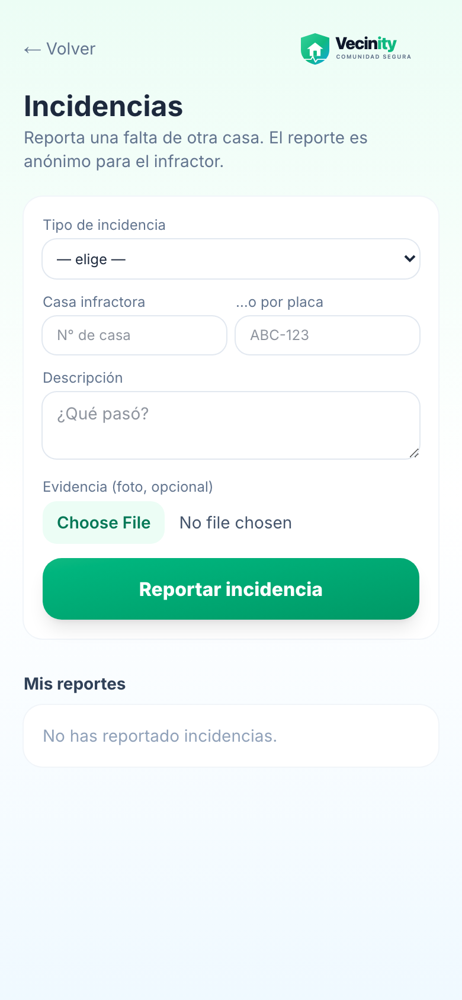

# 📖 Manual de Uso — Vecinity

> **Vecinity** es la app de tu colonia: te mantiene informado, te conecta con el comité y hace tu comunidad **más segura y organizada**. Desde tu teléfono puedes ver tu estado de cuenta, reservar la alberca o terraza, registrar visitas con un pase QR, dar de alta tus autos, pagar tu cuota, reportar incidencias y pedir ayuda con el **botón de pánico**. Y recibes los avisos importantes por Telegram.

---

## 🧭 Índice

**Para todos los vecinos**
1. [Cómo registrarte (primera vez)](#1-cómo-registrarte-primera-vez)
2. [Conectar Telegram (alertas)](#2-conectar-telegram)
3. [Esperar la aprobación del comité](#3-esperar-la-aprobación)
4. [Iniciar sesión (las siguientes veces)](#4-iniciar-sesión)
5. [Tu panel (residentes)](#5-tu-panel-residentes)
6. [Reservar áreas comunes](#6-reservar-áreas-comunes)
7. [Registrar una visita (pase QR)](#7-registrar-una-visita-pase-qr)
8. [Tus vehículos](#8-tus-vehículos)
9. [Pagar / subir comprobante](#9-pagar--subir-comprobante)
10. [Reportar una incidencia](#10-reportar-una-incidencia)
11. [Botón de pánico (SOS)](#11-botón-de-pánico-sos)

**Para el comité y la caseta**
12. [Panel del comité](#12-panel-del-comité)
13. [Gestionar áreas comunes](#13-gestionar-áreas-comunes)
14. [Vista de vigilancia (caseta)](#14-vista-de-vigilancia-caseta)

**Cierre**
15. [Notificaciones que recibirás](#15-notificaciones)
16. [Preguntas frecuentes](#16-preguntas-frecuentes)

---

## 1. Cómo registrarte (primera vez)

Tu comité te comparte un **código de invitación** (algo como `CAT-128`). Abre la app y sigue 4 pasos sencillos:

### Paso 1 — Tu invitación
Escribe el código que te dieron y toca **Continuar**.

### Paso 2 — Crea tu cuenta
Pon tu **nombre, correo, una contraseña** y tu **WhatsApp/teléfono**. Tu colonia y calle ya vienen en la invitación. Toca **Crear cuenta**.

### Paso 3 — Conecta tus alertas
Toca **Conectar Telegram** para recibir avisos (SOS, pagos, noticias del comité). Puedes hacerlo después si prefieres.

### Paso 4 — ¡Listo!
Tu cuenta queda creada. El comité revisará tu solicitud y te avisará cuando tengas acceso.

---

## 2. Conectar Telegram

Al tocar **Conectar Telegram**, se abre el bot **Caty** (@Caty_VCatania_bot). Presiona **Iniciar / Start** y Caty te confirmará:

> ✅ *¡Listo! Soy Caty 🛡️. Desde ahora te aviso por aquí: alertas SOS de tu zona, recordatorios de pago y noticias del comité.*

A partir de ese momento, las notificaciones te llegan directo a tu Telegram.

---

## 3. Esperar la aprobación

Mientras el comité aprueba tu solicitud, verás esta pantalla. Es normal: en cuanto te aprueben, podrás entrar a tu panel (y te avisaremos por Telegram si lo conectaste).

---

## 4. Iniciar sesión

Las siguientes veces, entra con tu **correo y contraseña**.

> ¿Olvidaste que ya tenías cuenta? En la pantalla de registro hay un enlace **"¿Ya tienes cuenta? Inicia sesión"**.

---

## 5. Tu panel (residentes)

Una vez aprobado, este es tu panel. Aquí ves todo de un vistazo:

- **Tu saldo**: verde si estás al corriente, **ámbar si tienes adeudo**.
- **Reservar áreas comunes**: alberca y terraza con disponibilidad en vivo.
- **Acciones rápidas**: pagar/subir comprobante, tus vehículos, registrar visita, reportar incidencia.
- **🆘 Botón de pánico (SOS)**: en una emergencia, tócalo.

---

## 6. Reservar áreas comunes

Toca **Reservar áreas comunes**. Elige qué quieres reservar (por ejemplo **Alberca** — gratis, o **Terraza** — evento con costo y depósito), revisa la **disponibilidad del día** y confirma tu horario.

> 💡 Solo puedes reservar si estás **al corriente** con tu cuota. La alberca es de uso compartido; la terraza se reserva como evento (aforo y costo según el reglamento). Tus reservas aparecen en **"Mis reservas"**, donde también puedes cancelarlas.

---

## 7. Registrar una visita (pase QR)

Toca **Registrar visita**, escribe el **nombre de tu invitado** y (opcional) cuándo llega. Toca **Generar pase de visita**.

Se crea un **pase con código QR** que puedes **compartir por WhatsApp** con tu invitado:

Tu invitado solo muestra ese pase en la **caseta** — no necesita instalar nada. Así lo ve el guardia al abrirlo:

---

## 8. Tus vehículos

Toca **Mis vehículos** para dar de alta tus autos: elige **marca y modelo**, escribe la **placa** y el **color**, y toca **Agregar vehículo**. El comité lo aprueba y (si aplica) le asigna su **tarjeta RFID** para la pluma de acceso.

> Cada auto queda en estado **pendiente** hasta que el comité lo aprueba. Puedes quitar los que aún no estén aprobados.

---

## 9. Pagar / subir comprobante

Toca **Pagar / Subir comprobante**. Ahí ves tu **saldo** y puedes **registrar un abono** subiendo la **foto de tu comprobante** de depósito o transferencia.

> El comité revisa tu comprobante y, al aprobarlo, **tu saldo se actualiza automáticamente**. Verás todos tus movimientos en la lista.

---

## 10. Reportar una incidencia

Toca **Reportar incidencia** para avisar de un problema (ruido, mal uso de amenidades, mascotas, fachada, etc.). Elige la **categoría**, indica la **casa o placa** del infractor, describe lo que pasó y adjunta una **foto** de evidencia.

> Tu reporte es **anónimo** para el infractor. El comité lo revisa y decide; si aplica multa, el monto sube por reincidencia (con un tope definido por tu colonia).

---

## 11. Botón de pánico (SOS)

En una emergencia real, toca el **🆘 Botón de pánico**. Al instante se avisa al **comité de tu zona y al capitán de calle** con tu nombre, casa y ubicación.

> ⚠️ Úsalo solo para **emergencias reales**.

---

## 12. Panel del comité

Si eres parte del **comité** o **administración**, desde tu panel entras al **Panel del comité**, tu centro de mando:

- **Pendientes por revisar**: abonos, vehículos, incidencias y nuevos vecinos, todo en un lugar.
- **Finanzas de la colonia**: adeudo total, saldo a favor, # de morosos y # al corriente.
- **Cobros del mes**: generar la cuota mensual y aplicar recargos (con un toque, sin duplicar).
- **Convenios de pago** y **mayores adeudos** (top de casas con saldo).

También apruebas a los nuevos vecinos desde **Solicitudes pendientes** en tu panel principal:

---

## 13. Gestionar áreas comunes

Desde **Gestionar áreas comunes**, el comité define las **reglas** de cada área: horarios, costo, depósito, aforo, si se aprueba automáticamente, e incluso **agregar nuevas áreas**. Aquí también aparece la **bandeja de reservas** por aprobar.

---

## 14. Vista de vigilancia (caseta)

El **guardia** entra directo a su pantalla de operación. Desde ahí controla todo el movimiento de la caseta:

- **Turno**: iniciar y cerrar turno.
- **Buscar placa** de un vehículo registrado.
- **Visitas**: marcar **entrada / salida** (incluye los pases QR que generan los vecinos). Antes de la entrada, el guardia puede tomar una **foto del INE** 📷.
- **Registrar visita en caseta** (botón **+ En caseta**): para un visitante que llega **sin pase**. Captura su nombre, casa destino, placa y **fotos de INE y placas**.
- **Reservas de hoy**: entregar y recibir la llave del área.
- **Servicios de la villa** (alberca, limpieza, basura, jardinería), **proveedores recurrentes** y **paquetes**.
- **Historial de hoy**: todas las entradas y salidas del día, con acceso a las fotos de INE/placas.

---

## 15. Notificaciones

Si conectaste Telegram, **Caty** te avisará automáticamente de:

| Aviso | Cuándo |
|---|---|
| 🚨 **SOS / Pánico** | Cuando un vecino de tu zona activa el botón (al comité y capitán) |
| 💸 **Saldo pendiente** | Cuando tu adeudo supera el límite — para que revises tus pagos |
| ⏰ **Pago vencido** | Si tu cuota pasó la fecha de vencimiento (aviso de recargo) |

---

## 16. Preguntas frecuentes

**¿No me llega el código de invitación?**
Pídeselo al comité de tu colonia.

**¿Por qué no puedo entrar todavía?**
Tu cuenta está en revisión. El comité debe aprobarte (Paso 4).

**¿Puedo reservar si debo dinero?**
No. Para reservar áreas comunes debes estar **al corriente** con tu cuota.

**¿Mi invitado necesita instalar la app?**
No. Solo muestra el **pase QR** que le compartiste por WhatsApp en la caseta.

**¿Puedo usarla sin Telegram?**
Sí, pero **no recibirás los avisos automáticos** (SOS, pagos). Recomendamos conectarlo.

**¿Mis datos están seguros?**
Sí. Cada quien ve solo lo de su colonia, y la información sensible está protegida.

---

*Vecinity · Comunidad Segura — Powered by NexIA*
